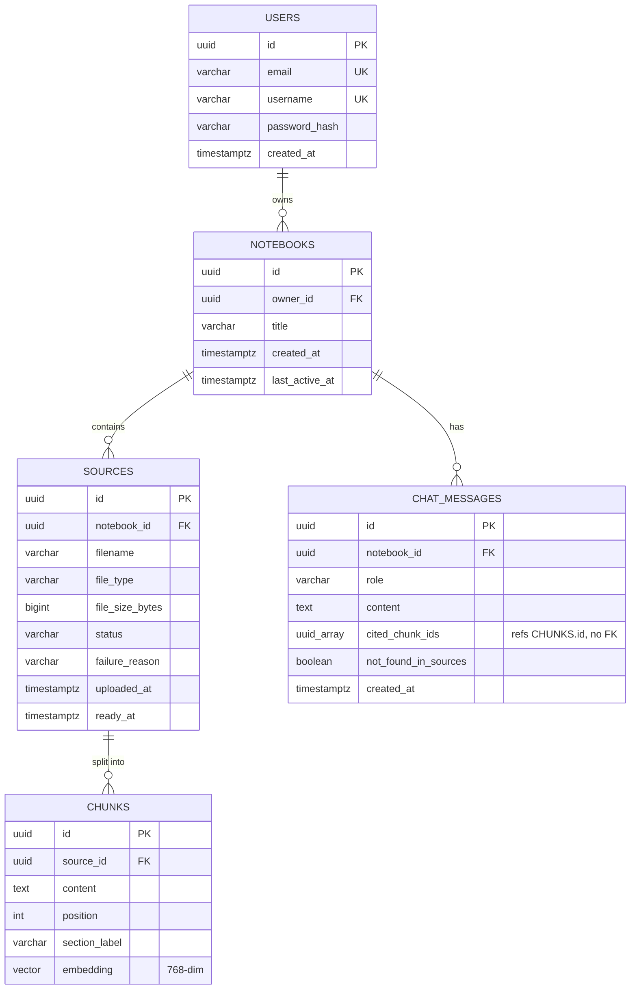

# Study LLM — Notebook RAG Chat

Organize course materials into notebooks, upload source documents, and ask an
AI assistant questions answered strictly from that notebook's sources — with
citations, or an explicit "not found" response. See
[specs/001-notebook-rag-chat/spec.md](specs/001-notebook-rag-chat/spec.md)
for the full feature spec.

## Documentation

| Doc | Audience | Covers |
|---|---|---|
| [docs/requirements.md](docs/requirements.md) | Devs, testers | Functional/non-functional requirements, operating environment |
| [docs/architecture.md](docs/architecture.md) | Devs | System structure, module layout, data/request flow, key design decisions |
| [docs/technical.md](docs/technical.md) | Devs | API reference, algorithms (chunking, retrieval), database structure, configuration |
| [docs/user-guide.md](docs/user-guide.md) | End users | Getting started, notebooks/sources/chat, FAQ, troubleshooting |

## Prerequisites

- Java 21+, Maven
- Node 20+
- PostgreSQL 16+ with the [`pgvector`](https://github.com/pgvector/pgvector) extension available
  (e.g. the `pgvector/pgvector:pg16` Docker image)
- [Ollama](https://ollama.com) installed and running locally, with the chat and embedding models
  pulled:

  ```bash
  ollama pull qwen3:8b
  ollama pull nomic-embed-text
  ```

## Data model



`chat_messages.cited_chunk_ids` is a plain `UUID[]` pointing at `chunks.id`; it's not a real
foreign key, so it's shown as a plain column rather than a relationship. See
[`V1__init_schema.sql`](backend/src/main/resources/db/migration/V1__init_schema.sql) for the
authoritative schema.

## Environment variables

| Variable | Required | Default | Purpose |
|---|---|---|---|
| `STUDYLLM_DB_URL` | yes | `jdbc:postgresql://localhost:5432/studyllm` | Postgres JDBC URL |
| `STUDYLLM_DB_USER` | yes | `studyllm` | Postgres username |
| `STUDYLLM_DB_PASSWORD` | yes | `studyllm` | Postgres password |
| `STUDYLLM_JWT_SECRET` | yes | *(none — startup fails without it)* | HMAC secret for signing JWTs |
| `STUDYLLM_JWT_EXPIRATION_MINUTES` | no | `1440` | JWT access token lifetime |
| `STUDYLLM_OLLAMA_BASE_URL` | no | `http://localhost:11434` | Ollama server URL |
| `STUDYLLM_CHAT_MODEL` | no | `qwen3:8b` | Ollama chat/generation model |
| `STUDYLLM_EMBEDDING_MODEL` | no | `nomic-embed-text` | Ollama embedding model |

## Run locally

```bash
# Postgres with pgvector (adjust credentials to match the env vars above)
docker run -d --name studyllm-postgres \
  -e POSTGRES_DB=studyllm -e POSTGRES_USER=studyllm -e POSTGRES_PASSWORD=studyllm \
  -p 5432:5432 pgvector/pgvector:pg16

# Backend (separate terminal)
cd backend
STUDYLLM_JWT_SECRET=dev-only-secret-change-me ./mvnw spring-boot:run

# Frontend (separate terminal)
cd frontend
npm install
npm run dev
```

Health check:

```bash
curl http://localhost:8080/actuator/health
```

Open the frontend dev server URL printed by `npm run dev` (proxies `/api` to
`localhost:8080`).

## Testing

```bash
# Backend unit tests
cd backend && ./mvnw test

# Backend integration tests (Testcontainers — needs Docker, and a local Ollama
# with qwen3:8b + nomic-embed-text pulled, since the RAG tests hit it for real)
cd backend && ./mvnw verify

# Frontend
cd frontend && npm run lint && npm test && npm run build
```

## Troubleshooting

- **Another service is already using port 11434.** Some Docker stacks (e.g. a
  Swarm service publishing its own Ollama container) can silently intercept
  `localhost:11434` ahead of a native Ollama install, so requests never reach
  the models you pulled. Symptom: uploads/chat hang in `PROCESSING` forever
  with no error logged, and `curl localhost:11434/api/tags` shows a different
  model list than `ollama list`. Fix: run a second Ollama instance on another
  port (`OLLAMA_HOST=127.0.0.1:11435 ollama serve`) and point
  `STUDYLLM_OLLAMA_BASE_URL` at it.
- **Testcontainers can't find a valid Docker environment on Windows**, even
  though `docker ps` works fine, if Docker Desktop's Windows named-pipe API
  returns an empty `/info` response to the Java Docker client (a Docker
  Desktop/docker-java compatibility quirk, not a code issue). If `./mvnw
  verify` fails with `Could not find a valid Docker environment`, that's this;
  there's no in-repo fix — it depends on your local Docker Desktop version.
