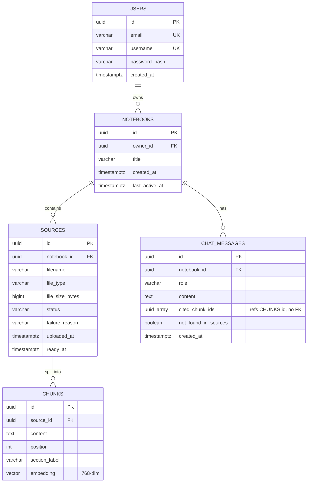

# Study LLM — Notebook RAG Chat

Organize course materials into notebooks, upload source documents, and ask an
AI assistant questions answered strictly from that notebook's sources — with
citations, or an explicit "not found" response. See
[specs/001-notebook-rag-chat/spec.md](specs/001-notebook-rag-chat/spec.md)
for the full feature spec.

## Documentation

| Doc | Audience | Covers |
|---|---|---|
| [docs/requirements.md](docs/requirements.md) | Devs, testers | Functional/non-functional requirements, operating environment |
| [docs/architecture.md](docs/architecture.md) | Devs | System structure, module layout, data/request flow, key design decisions |
| [docs/technical.md](docs/technical.md) | Devs | API reference, algorithms (chunking, retrieval), database structure, configuration |
| [docs/user-guide.md](docs/user-guide.md) | End users | Getting started, notebooks/sources/chat, FAQ, troubleshooting |

## Prerequisites

- Java 21+, Maven
- Node 20+
- PostgreSQL 16+ with the [`pgvector`](https://github.com/pgvector/pgvector) extension available
  (e.g. the `pgvector/pgvector:pg16` Docker image)
- [Ollama](https://ollama.com) installed and running locally, with the chat and embedding models
  pulled:

  ```bash
  ollama pull qwen3:8b
  ollama pull nomic-embed-text
  ```

- Tesseract language data, for OCR of scanned/image-only documents. The Tesseract engine itself
  ships with the `tess4j` Maven dependency (no system install), but the language file is a 22MB
  binary that is not committed — download it into `backend/tessdata/`:

  ```bash
  curl -L --create-dirs -o backend/tessdata/eng.traineddata https://github.com/tesseract-ocr/tessdata/raw/main/eng.traineddata
  ```

  If this file is missing, ingestion still works: OCR falls back to the Ollama vision model,
  which is roughly 25x slower and markedly less accurate on text-heavy pages.

## Data model



`chat_messages.cited_chunk_ids` is a plain `UUID[]` pointing at `chunks.id`; it's not a real
foreign key, so it's shown as a plain column rather than a relationship. See
[`V1__init_schema.sql`](backend/src/main/resources/db/migration/V1__init_schema.sql) for the
authoritative schema.

## Document ingestion & OCR

Uploads run through extract → chunk → embed → persist on a background thread, so the request
returns immediately with the source in `PROCESSING`. Only the final write is transactional:
extraction can take minutes on a scanned document, and holding a pooled connection for that long
would starve the pool and stall unrelated requests.

Text is extracted natively where the format allows (PDFBox for PDFs, POI for DOCX/PPTX). Pages
and embedded images with no extractable text — scans, screenshots, slide photos — fall through to
OCR:

1. **Tesseract** (via the `tess4j` dependency, no system install) transcribes the image. Images
   are sent at full resolution, since Tesseract's accuracy scales with effective DPI.
2. **Ollama vision model** (`llava:7b` by default) is tried only if Tesseract returns almost
   nothing, which usually means a diagram or photo rather than a page of text.

Tesseract leads because it measured both far faster and far more accurate on real lecture slides:
a 31-page scanned PDF took **~23s end-to-end** versus **~11.5 minutes** with the vision model, and
it transcribes the page instead of describing it. The vision model was observed inventing
plausible-but-wrong content — citing "Section 8.5" for a page that reads "Section 6.2" — which is
the more dangerous failure mode for a study tool, because nothing downstream can distinguish it
from a real citation.

### Math symbol repair

Tesseract's `eng` model has no `∪ ∩ ∅ ᶜ` in its character repertoire, so it emits the nearest
Latin lookalike: `A ∪ ∅ = A` arrives as `AUPp=A`. Left alone this silently corrupts answers — the
chat model, shown `AUPp=A`, confidently stated the wrong identity `A ∪ U = A`.

`MathSymbolRepair` restores the notation after OCR. Every substitution is ambiguous in isolation
(`U` is both the union operator and the universal set; `N` is both intersection and a letter), so
it only rewrites whitespace-free tokens containing `=` and built purely from set-algebra
characters, and only converts an operator when it is flanked by operands on both sides — which is
what correctly resolves `AUU=U` into `A∪U=U`. Prose contains spaces and is never eligible.
Measured over a 31-page lecture PDF: 22 lines repaired, no prose altered, no incorrect
substitution. It costs no measurable time, being regex over already-extracted text.

`C` is deliberately never converted to `⊆` — it collides with the conventional set name C too
often to be safe.

## Retrieval

Chat retrieves the nearest chunks by cosine distance, then widens each hit to its adjacent chunks
in the same source (`studyllm.chat.retrieval-neighbor-radius`, default 1). Content that runs past
a page break otherwise leaves the continuation nearly unretrievable: it inherits none of the
heading that makes it match the question. Measured on a real lecture PDF, "list all 12 set
identities" ranked the page holding identities 1–6 at #2 but the page holding 7–12 at #18, so the
answer silently covered only half the theorem. Results are returned in document order so a split
section reads continuously in the prompt.

## Environment variables

| Variable | Required | Default | Purpose |
|---|---|---|---|
| `STUDYLLM_DB_URL` | yes | `jdbc:postgresql://localhost:5432/studyllm` | Postgres JDBC URL |
| `STUDYLLM_DB_USER` | yes | `studyllm` | Postgres username |
| `STUDYLLM_DB_PASSWORD` | yes | `studyllm` | Postgres password |
| `STUDYLLM_JWT_SECRET` | yes | *(none — startup fails without it)* | HMAC secret for signing JWTs |
| `STUDYLLM_JWT_EXPIRATION_MINUTES` | no | `1440` | JWT access token lifetime |
| `STUDYLLM_OLLAMA_BASE_URL` | no | `http://localhost:11434` | Ollama server URL |
| `STUDYLLM_CHAT_MODEL` | no | `qwen3:8b` | Ollama chat/generation model |
| `STUDYLLM_EMBEDDING_MODEL` | no | `nomic-embed-text` | Ollama embedding model |
| `STUDYLLM_VISION_MODEL` | no | `llava:7b` | Ollama vision model, used only as an OCR fallback |
| `STUDYLLM_TESSDATA_PATH` | no | `tessdata` | Directory holding `eng.traineddata` (relative to the backend working directory) |
| `STUDYLLM_OCR_CONCURRENCY` | no | `4` | Images OCR'd in parallel. Set to `1` if OCR falls back to the vision model on a CPU-only Ollama, where concurrent requests contend rather than parallelise |

## Run locally

```bash
# Postgres with pgvector (adjust credentials to match the env vars above)
docker run -d --name studyllm-postgres \
  -e POSTGRES_DB=studyllm -e POSTGRES_USER=studyllm -e POSTGRES_PASSWORD=studyllm \
  -p 5432:5432 pgvector/pgvector:pg16

# Backend (separate terminal)
cd backend
STUDYLLM_JWT_SECRET=dev-only-secret-change-me-please-this-is-32bytes-plus mvn spring-boot:run

# Frontend (separate terminal)
cd frontend
npm install
npm run dev
```

Health check:

```bash
curl http://localhost:8080/actuator/health
```

Open the frontend dev server URL printed by `npm run dev` (proxies `/api` to
`localhost:8080`).

## Testing

```bash
# Backend unit tests
cd backend && mvn test

# Backend integration tests (Testcontainers — needs Docker, and a local Ollama
# with qwen3:8b + nomic-embed-text pulled, since the RAG tests hit it for real)
cd backend && mvn verify

# Frontend
cd frontend && npm run lint && npm test && npm run build
```

## Troubleshooting

- **Another service is already using port 11434.** Some Docker stacks (e.g. a
  Swarm service publishing its own Ollama container) can silently intercept
  `localhost:11434` ahead of a native Ollama install, so requests never reach
  the models you pulled. Symptom: uploads/chat hang in `PROCESSING` forever
  with no error logged, and `curl localhost:11434/api/tags` shows a different
  model list than `ollama list`. Fix: run a second Ollama instance on another
  port (`OLLAMA_HOST=127.0.0.1:11435 OLLAMA_IGPU_ENABLE=1 ollama serve`) and
  point `STUDYLLM_OLLAMA_BASE_URL` at it.
- **Ingestion of a scanned document is very slow.** Check the backend log for
  `Tesseract OCR failed; falling back to the vision model`. Every page taking
  tens of seconds instead of about one means Tesseract isn't running — usually
  a missing `backend/tessdata/eng.traineddata` (see Prerequisites) — so every
  page is going to the vision model, which is ~25x slower. The fallback is
  deliberately silent about this beyond the log line, so ingestion still
  succeeds rather than failing outright.
- **The vision model itself is slow.** It only runs as an OCR fallback, but
  when it does: on a laptop with only an AMD integrated GPU, Ollama drops it by
  default — check the Ollama server log for `dropping integrated GPU; to
  enable, set OLLAMA_IGPU_ENABLE=1`. Setting that env var when starting
  `ollama serve` (see above) offloads inference to the iGPU via Vulkan:
  measured ~7.5x faster cold model load (312s → 41.5s) and ~1.8x faster token
  generation on this hardware. ROCm isn't available (AMD driver too old /
  unsupported gfx target for this iGPU generation), so Vulkan is the only
  backend in play — a discrete/CUDA GPU would do much better. On a CPU-only
  Ollama, also set `STUDYLLM_OCR_CONCURRENCY=1`: with a single worker,
  concurrent requests contend rather than parallelise.
- **An answer only covers part of a section that spans a page break.** Raise
  `studyllm.chat.retrieval-neighbor-radius` (see Retrieval). The trade-off is
  prompt size, which on local hardware is generation time.
- **Testcontainers can't find a valid Docker environment on Windows**, even
  though `docker ps` works fine, if Docker Desktop's Windows named-pipe API
  returns an empty `/info` response to the Java Docker client (a Docker
  Desktop/docker-java compatibility quirk, not a code issue). If `mvn
  verify` fails with `Could not find a valid Docker environment`, that's this;
  there's no in-repo fix — it depends on your local Docker Desktop version.
