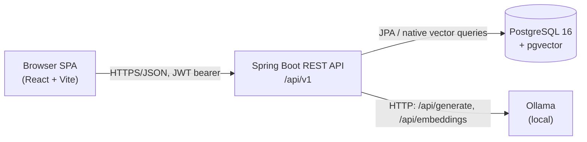
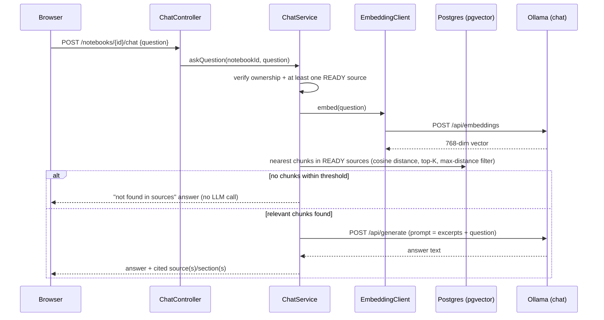
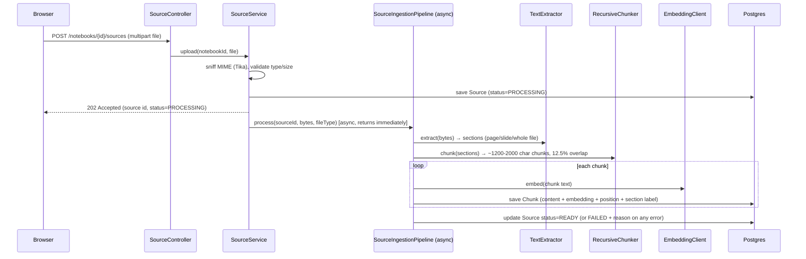

# Architecture Documentation

High-level view of how Study LLM is put together: components, data flow, and
interfaces. Minimal code — see [technical.md](technical.md) for
implementation-level detail and [requirements.md](requirements.md) for what
the system must do.

## System overview



Two deployable units — a React SPA and a Spring Boot API — plus two local
services the API depends on: Postgres (relational data **and** vector
storage, via `pgvector`) and Ollama (chat generation **and** embeddings, both
local, no cloud vendor or API key). See
[research.md](../specs/001-notebook-rag-chat/research.md) for why each of
those was chosen over alternatives.

## Backend module layout

The backend is organized by domain module, each following
Controller → Service → Repository:

```text
com.studyllm/
├── auth/       signup, login, JWT issuance/validation, profile & password self-service
├── notebook/   notebook CRUD + cross-notebook search
├── source/     upload, format detection, text extraction, chunking, async ingestion
│   └── extraction/   one TextExtractor per file format (PDF/DOCX/PPTX/plain text)
├── ai/         EmbeddingClient — shared Ollama embeddings client (source + chat)
├── chat/       ask/history, retrieval, grounded-answer generation
└── common/     cross-cutting: exception handling, security config, ownership guard
```

`ai` exists as its own module (rather than living inside `chat`) because
`EmbeddingClient` is used by both source ingestion and chat retrieval — it's
the one seam shared across two otherwise-independent domains.

## Frontend layout

```text
frontend/src/
├── auth/         login/signup pages, AuthContext (token + current user)
├── notebook/     Home page, notebook cards, search bar, new-notebook modal
├── sources/      source list, upload control, status indicators
├── chat/         conversation view, input bar, citation display
├── settings/     profile + password self-service
├── components/   shared primitives: GlassCard, IconButton, CollapsiblePanel, Sidebar
└── api/          typed fetch client + TanStack Query hooks, one file per domain
```

Server state (notebooks, sources, chat) is owned by TanStack Query — no
separate client-side store. `AuthContext` is the one piece of real client
state (current user + token), backed by `localStorage`.

## Request flow: asking a question



The "not found" path never calls the chat model — grounding is enforced by
retrieval, not by asking the LLM to police itself.

## Request flow: source ingestion



The upload request returns as soon as the `Source` row is saved — ingestion
runs on a separate thread so the UI can poll status without blocking the
upload response. A failure anywhere in extraction/chunking/embedding is
caught and turned into `Source.FAILED` with a human-readable reason; it never
propagates to fail the notebook or an unrelated request.

## Data flow summary

- **Write path** (upload): file bytes → extracted text sections → chunks →
  embeddings → persisted `Chunk` rows, each traceable back to its `Source`
  and position/section (for citations).
- **Read path** (chat): question → embedding → nearest-neighbor chunk search
  scoped to the notebook's `READY` sources → prompt assembly (excerpts +
  question) → LLM generation → answer + citations, persisted as a
  `ChatMessage`.
- **Isolation**: every read/write is scoped through `OwnershipGuard`
  (resolves the caller's user id from the JWT-backed security context) —
  ownership is never taken from client-supplied IDs.

See [data model / ERD](../README.md#data-model) for the underlying schema.

## Key design decisions

| Decision | Why |
|---|---|
| `pgvector` on the existing Postgres instance, not a standalone vector DB | One datastore, one transaction boundary; revisit only if chunk volume/query latency outgrows it. |
| Local Ollama for both chat and embeddings, not a cloud LLM API | No per-token cost, no API key, no network dependency for the app's core feature. |
| Hand-written `RecursiveChunker`, not a chunking framework (e.g. LangChain4j) | The algorithm is ~100 lines of well-defined logic; a framework would pull in abstractions (chains, prompt templates, vector-store wrappers) the app doesn't otherwise use. |
| Stateless JWT auth, not server-side sessions | Backend services stay stateless from day one, ahead of any future multi-instance deployment. |
| Ingestion runs `@Async` on its own thread/transaction | Upload requests return immediately; a `Source` row must actually commit before the async pipeline (on a different connection) can see it. |

Full rationale and alternatives considered for each decision live in
`specs/001-notebook-rag-chat/research.md` (local spec-kit workspace).
